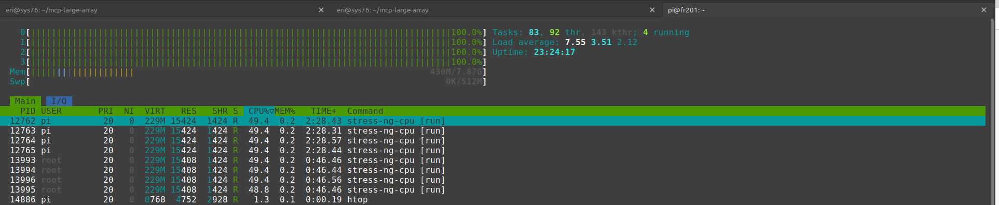

# loadTest
Load test edatec IPC 3100 with cm5, thought any pi should work.

sudo apt install stress-ng  
or use busy loops in python 
 Whats this script do?
  it loads the CPU and other resources to see what the computer does. 
 
It also keeps a log of that. 
timestamp,temp_C,freq_khz,load1,throttle_hex 
2026-01-20T19:01:48+00:00,37.3,2400000,0.19,0x0 

